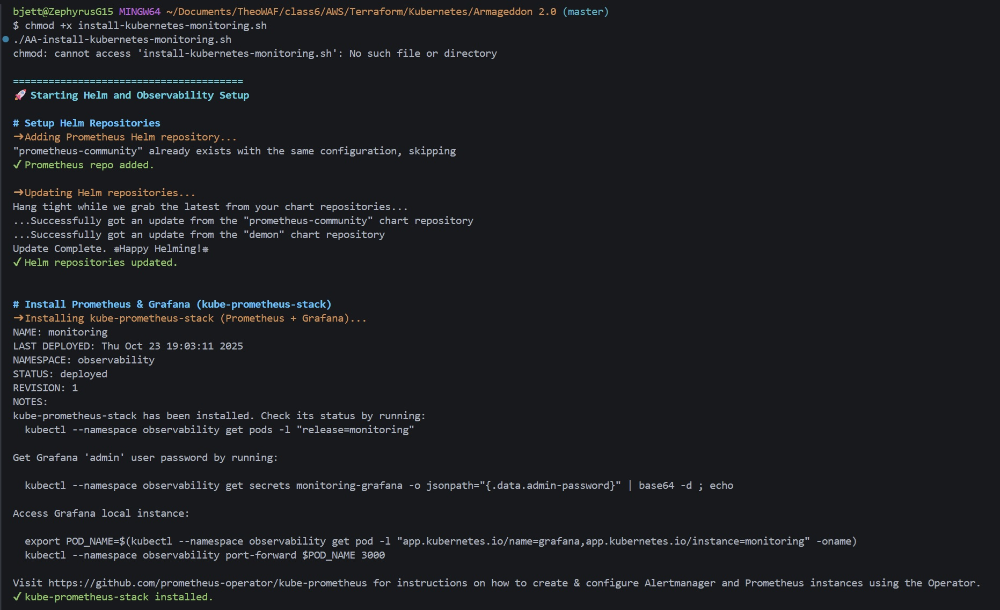
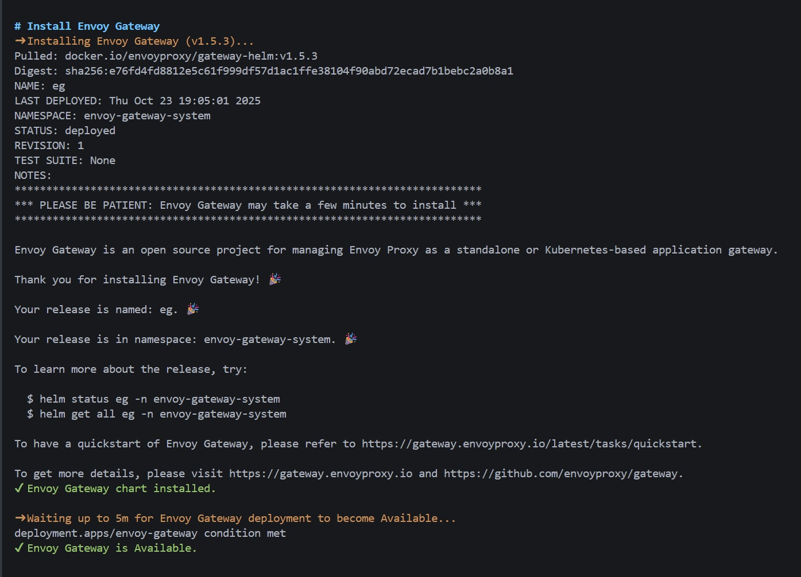
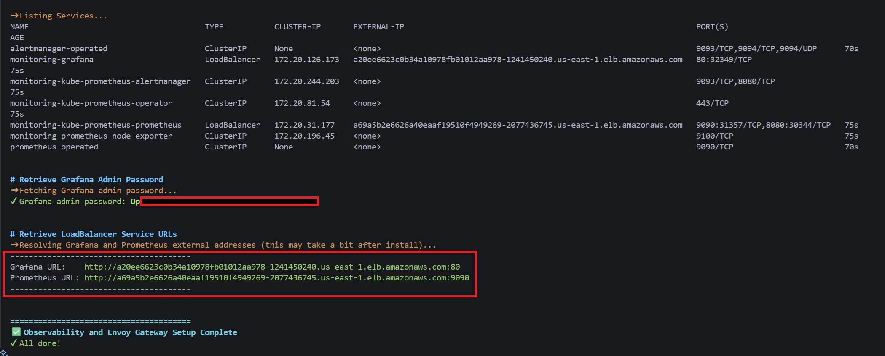
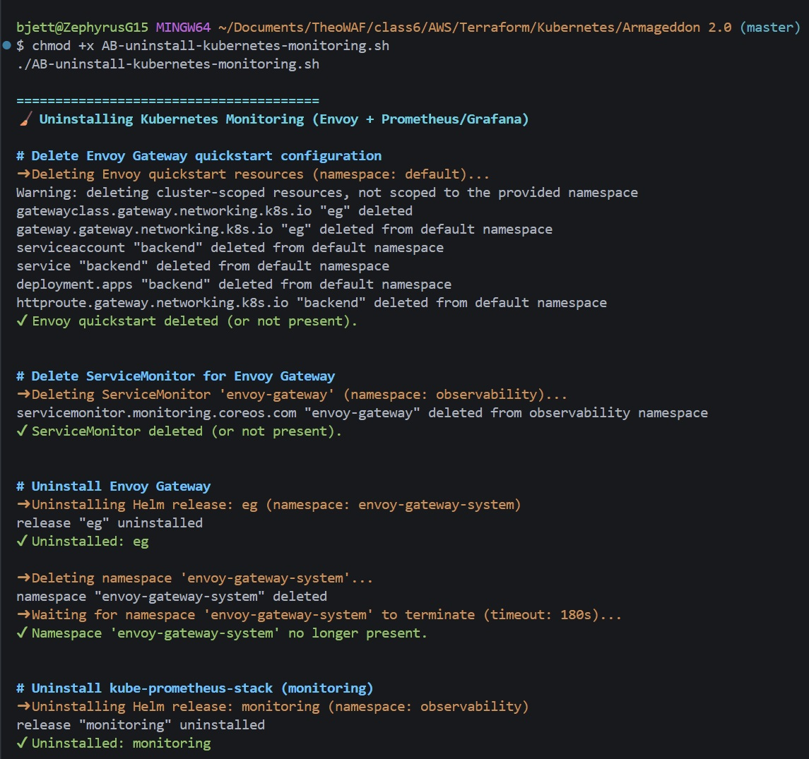
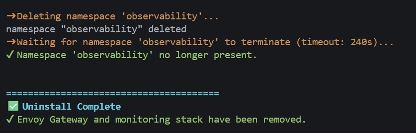

# 🌐 ARMAGEDDON Task 1 — Automated Kubernetes Observability Stack


---

## 📖 Overview

The **Network Team** aims to automate deployment and management of core observability components in an **Amazon EKS** cluster to reduce operational toil and streamline monitoring.  
This project automates the installation of:

- **Envoy Gateway** (for ingress and routing)
- **Prometheus** (for metrics collection)
- **Grafana** (for visualization)

All deployments are handled using Helm, with verification and cleanup scripts provided for full lifecycle management.

---

## 🧠 Task 1 — Network Infrastructure Automation

### Objective

The **Network Team** aims to automate a portion of their Kubernetes-based network infrastructure within an **Amazon EKS** cluster.  
This task involves deploying and validating a complete observability and gateway stack using **Helm**.

### Requirements

1. Configure and launch the following components in your EKS cluster:
   - **Envoy Gateway** — for ingress and routing management  
   - **Prometheus** — for metrics collection and alerting  
   - **Grafana** — for metrics visualization and dashboarding
2. Automate the deployment process using scripts or Helm commands to **minimize operational toil**.
3. Capture **screenshots** of the cluster running all three services to verify successful deployment.
4. Document the entire setup process and verification steps in the **README.md** file.

### Deliverables

- 📂 **Automated Installation Scripts** (`AA-install-kubernetes-monitoring.sh`)
- 📂 **Automated Uninstallation Script** (`AB-uninstall-kubernetes-monitoring.sh`)
- 📸 **Screenshots Folder** (`Screenshots/`) containing installation and validation proof
- 📜 **Detailed Documentation** (this README) describing deployment, verification, and teardown steps

### Expected Outcome

By the end of this task, the Network team should be able to:

- Deploy **Envoy**, **Prometheus**, and **Grafana** automatically with a single script.  
- Validate that all observability components are operational within the EKS cluster.  
- Re-run or uninstall the setup cleanly with minimal manual intervention.  
- Reference clear documentation and screenshots for review or auditing.

---

## 🧩 Project Structure

```plaintext
ARMAGEDDON 2.0/
├── Screenshots/                              # Evidence & walkthrough images
│   ├── demo.jpg
│   ├── install-pt1.jpg
│   ├── install-pt2.jpg
│   ├── install-pt3.jpg
│   ├── install-pt4.jpg
│   ├── terraform-apply.jpg
│   ├── terraform-destroy.jpg
│   ├── uninstall-pt1.jpg
│   └── uninstall-pt2.jpg
├── .gitignore                                # Ignore files
├── 0-var.tf                                  # Terraform variables
├── 1-auth.tf                                 # Authentication setup
├── 2-vpc.tf                                  # VPC creation
├── 3-subnets.tf                              # Subnet definitions
├── 4-igw.tf                                  # Internet Gateway setup
├── 5-nat.tf                                  # NAT Gateway setup
├── 6-rtb.tf                                  # Route tables
├── 7-eks.tf                                  # EKS cluster definition
├── 8-node.tf                                 # Node group definitions
├── 9-runtime.tf                              # Runtime configs
├── 10-iam-oidc.tf                            # IAM OIDC provider setup
├── 11a-storage-iam.tf                        # IAM policies for Prometheus/Grafana
├── 11b-storage-helm.tf                       # Helm storage configurations
├── 12-output.tf                              # Terraform outputs
├── AA-install-kubernetes-monitoring.sh       # Automated install script
├── AB-uninstall-kubernetes-monitoring.sh     # Automated uninstall script
├── DEPLOY.md                                 # Extended deployment notes
└── README.md                                 # Project documentation

```

---

## 🚀 Deployment Instructions

### Prerequisites

- A running **EKS cluster** (Terraform files included for provisioning)
- **Helm v3+**
- **kubectl** configured to target your cluster
- Adequate IAM permissions for Helm and Kubernetes operations

---

### Step 1 – Provision Infrastructure

Use the Terraform files to build the cluster:

```bash
terraform init
terraform fmt
terraform validate
terraform plan
terraform apply -auto-approve
```


Wait for the EKS cluster and node groups to become active.

`12-output.tf`

```plaintext
ebs_csi_iam_role_arn = "arn:aws:iam::866340886126:role/demo-ebs-csi-iam-role"
eks_cluster_info = {
  "arn" = "arn:aws:eks:us-east-1:866340886126:cluster/demo"
  "description" = "EKS cluster info"
  "endpoint" = "https://F8531A6EDEA95F447C6027F21DC80FB7.gr7.us-east-1.eks.amazonaws.com"
  "id" = "demo"
  "name" = "demo"
}
eks_node_group_summary = "Node group 'demo-private-nodes' runs 2 instance(s) of type t3.small"
openid_connect_provider = {
  "arn" = "arn:aws:iam::866340886126:oidc-provider/oidc.eks.us-east-1.amazonaws.com/id/F8531A6EDEA95F447C6027F21DC80FB7"
  "url" = "https://oidc.eks.us-east-1.amazonaws.com/id/F8531A6EDEA95F447C6027F21DC80FB7"
}
```

---

### Step 2 – Deploy Observability Stack

Run the automated installation script:

```bash
chmod +x AA-install-kubernetes-monitoring.sh
./AA-install-kubernetes-monitoring.sh
```

This script:

1. Adds the Prometheus Helm repository.  
2. Installs **Prometheus + Grafana** via `kube-prometheus-stack`.  
3. Installs **Envoy Gateway** (`v1.5.3`) via Helm.  
4. Applies the Envoy Quickstart configuration.  
5. Creates a **ServiceMonitor** for Envoy metrics.  
6. Prints the Grafana admin password and service URLs.




---

### Step 3 – Verify the Deployment

After 3–5 minutes, confirm all services are running:

```bash
kubectl get pods -n observability
kubectl get svc -n observability
kubectl get pods -n envoy-gateway-system
```

Expected outputs:

- `monitoring-kube-prometheus-prometheus`
- `monitoring-grafana`
- `envoy-gateway`

---

### Step 4 – Access Grafana & Prometheus

Retrieve the external LoadBalancer URLs:

```bash
kubectl get svc -n observability
```


Visit:

- **Grafana** → `http://&lt;grafana-loadbalancer&gt;:80`
- **Prometheus** → `http://&lt;prometheus-loadbalancer&gt;:9090`

Retrieve Grafana password:

```bash
# Retrieve the Grafana admin password from the Kubernetes secret
kubectl get secret monitoring-grafana \
  --namespace observability \
  --output jsonpath="{.data.admin-password}" | base64 --decode && echo
```



---

## 🎥 Demo Video

A full walkthrough of deployment and monitoring verification is available:  

[](https://www.youtube.com/watch?v=Ur_WtZtClqc)

---

## 🧠 Key Benefits

- 🔁 **Automation**: One-click install/uninstall reduces manual toil.  
- 🧍‍♂️ **Team Efficiency**: Network team can focus on analysis, not setup.  
- 📊 **Observability**: Centralized monitoring of Envoy metrics via Prometheus + Grafana.  
- 🛡 **Consistency**: Infrastructure as Code ensures repeatable deployments.

---

## 🧼 Uninstall Instructions

To cleanly remove Envoy, Prometheus, and Grafana:

```bash
chmod +x AB-uninstall-kubernetes-monitoring.sh
./AB-uninstall-kubernetes-monitoring.sh
```

This script:

- Removes Helm releases safely.  
- Deletes namespaces (`observability` and `envoy-gateway-system`).  
- Waits for graceful termination.  
- Supports re-runs without errors.




---

## 🛠 Troubleshooting

| Issue | Cause | Resolution |
|------|------|-----------|
| `LoadBalancer hostname pending` | AWS ELB creation delay | Wait 3–5 minutes and re-run `kubectl get svc -n observability`. |
| `Grafana password not found` | Secret not yet created | Run the password command again after pods stabilize. |
| `Helm release already exists` | Script rerun without uninstall | Run the uninstall script first, then re-run install. |
| `Namespace stuck in Terminating` | Finalizer on CRD or resource | Run `kubectl get ns &lt;name&gt; -o json \| jq '.spec.finalizers=[]' \| kubectl replace --raw "/api/v1/namespaces/&lt;name&gt;/finalize" -f -`. |
| `Metrics not visible in Grafana` | ServiceMonitor mismatch | Ensure the ServiceMonitor selector matches Envoy labels. |

---

## ✍️ Authors & Acknowledgments

- **Author:** T.I.Q.S.
- **Group Leader:** John Sweeney

---
