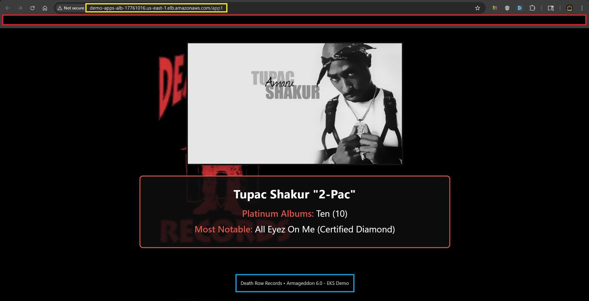
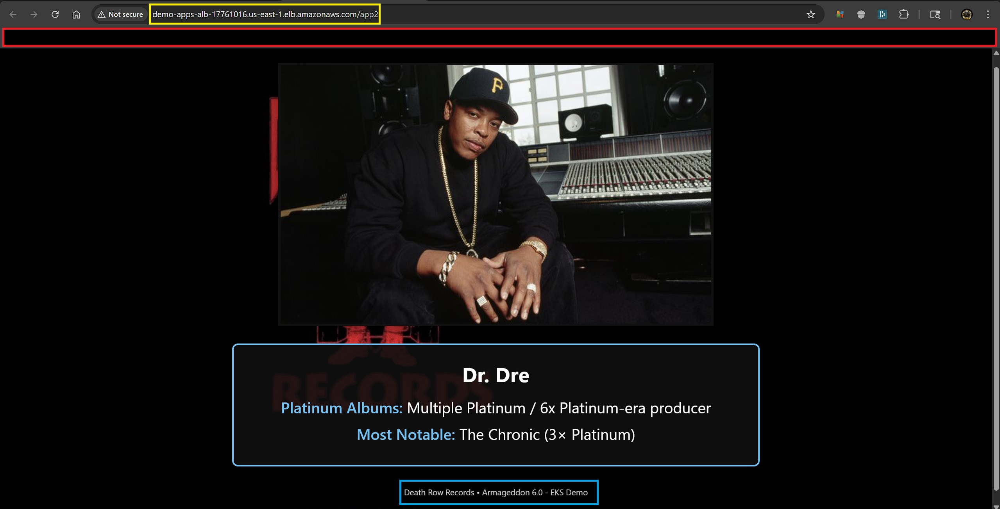
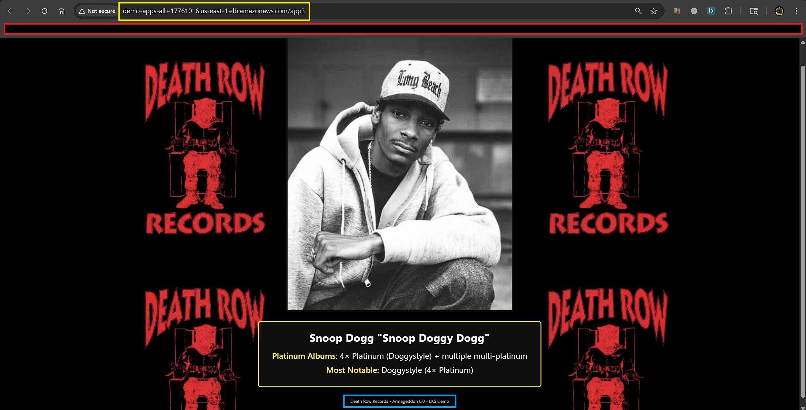

# 🚀 **Task 2 – Docker + Kubernetes Deployment (ECR → EKS)**


Production-grade demonstration of containerized microservices deployed to **Amazon EKS** behind a shared Application Load Balancer.

---

## 📘 **Table of Contents**

- [**Project Overview**](#-project-overview)
- [**Project Structure**](#-project-structure)
- [**Architecture & Network Diagram**](#️-architecture--network-diagram)
- [**Key Architecture Components**](#-key-architecture-components)
- [**Network Diagram**](#️-network-diagram)
- [**Project Structure**](#-project-structure)
- [**Step 1 — Terraform Deployment**](#️-step-1--terraform-deployment)
- [**Step 2 — Build & Push Docker Images to ECR**](#-step-2--build-docker-images--push-to-ecr)
- [**Step 3 — Deploy to EKS**](#️-step-3--deploy-to-eks)
- [**Step 4 — Accessing the Applications**](#-step-4--accessing-the-applications)
- [**Step 5 — Application Screenshots**](#-step-5--application-screenshots)
- [**Step 6 — Clean Up Application Layer**](#-step-6--clean-up-application-layer)
- [**Step 7 — Full Teardown (Infrastructure)**](#-step-7--full-teardown-infrastructure)
- [**Interview Talking Points**](#-interview-talking-points)
- [**References**](#-references)
- [**Troubleshooting**](#-troubleshooting)

---

## 🌟 **Project Overview**

Three lightweight Flask applications (each displaying artist information from Death Row Records) are:

- Containerized with Docker
- Built and pushed to **Amazon ECR**
- Deployed as Kubernetes Deployments with HPA autoscaling
- Exposed externally via a **single** AWS Application Load Balancer using path-based routing
- Made highly available across multiple AZs
- Equipped with readiness/liveness probes and proper health checks

Infrastructure is fully managed with Terraform (VPC, EKS cluster, node groups, OIDC provider, IAM roles for IRSA, etc.).

---

## 🏗️ **Architecture & Network Diagram**

This deployment uses a **layered AWS architecture** that separates infrastructure, orchestration, and application delivery. The environment is provisioned using **Terraform** and consists of a VPC, public/private subnets, an EKS cluster, and a shared Application Load Balancer managed by the **AWS Load Balancer Controller**.

### 🔑 **Key Architecture Components**

| **Component**                    | **Purpose**                                 |
| -------------------------------- | ------------------------------------------- |
| **VPC**                          | Isolated AWS network environment            |
| **Public Subnets**               | Host the external Application Load Balancer |
| **Private Subnets**              | Host EKS worker nodes                       |
| **EKS Cluster**                  | Kubernetes control plane                    |
| **Node Groups**                  | EC2 worker nodes running application pods   |
| **AWS Load Balancer Controller** | Dynamically provisions ALB resources        |
| **ECR**                          | Stores container images for deployment      |
| **Kubernetes Ingress**           | Routes external traffic to services         |

### 🖼️ Network Diagram


This diagram illustrates:

- Internet traffic entering through the **Application Load Balancer**
- Path-based routing handled by **Kubernetes Ingress**
- Requests forwarded to **Kubernetes Services**
- Pods distributed across **EKS worker nodes**

---

## 📁 **Project Structure**

```text
task-2/
├── apps/                                       # Application source code (three Flask microservices)
│   ├── app1/
│   │   ├── app1.py
│   │   ├── requirements.txt
│   │   ├── Dockerfile
│   │   ├── templates/
│   │   │   └── index.html
│   │   └── static/
│   │       ├── styles.css
│   │       ├── app1.jpg
│   │       └── death-row-bg.jpg
│   ├── app2/
│   │   ├── app2.py
│   │   ├── requirements.txt
│   │   ├── Dockerfile
│   │   ├── templates/
│   │   │   └── index.html
│   │   └── static/
│   │       ├── styles.css
│   │       ├── app2.jpg
│   │       └── death-row-bg.jpg
│   └── app3/
│       ├── app3.py
│       ├── requirements.txt
│       ├── Dockerfile
│       ├── templates/
│       │   └── index.html
│       └── static/
│           ├── styles.css
│           ├── app3.jpg
│           └── death-row-bg.jpg
|
├── manifests/                                  # Kubernetes manifests (Deployments, Services, HPA, Ingress, Namespace)
│   ├── app1-deployment.yaml
│   ├── app1-hpa.yaml
│   ├── app1-service.yaml
│   ├── app2-deployment.yaml
│   ├── app2-hpa.yaml
│   ├── app2-service.yaml
│   ├── app3-deployment.yaml
│   ├── app3-hpa.yaml
│   ├── app3-service.yaml
│   ├── apps-ingress.yaml
│   └── apps-namespace.yaml
│
└── Screenshots/                                # Visual proof & documentation
│   ├── app1-complete.jpg                       # Final rendered page – Tupac Shakur
│   ├── app2-complete.jpg                       # Final rendered page – Dr. Dre
│   ├── app3-complete.jpg                       # Final rendered page – Snoop Dogg
│   ├── aws-ecr-private-repo-for-apps.jpg       # ECR repositories with images
│   ├── cleanup-app.jpg                         # destroy-all-apps.sh output
│   ├── deploy-app-pt1.jpg                      # deploy-all-apps.sh execution (multi-part)
│   ├── deploy-app-pt2.jpg                      # deploy-all-apps.sh execution (multi-part)
│   ├── deploy-app-pt3.jpg                      # deploy-all-apps.sh execution (multi-part)
│   ├── deploy-app-pt4.jpg                      # deploy-all-apps.sh execution (multi-part)
│   ├── diagram.jpeg                            # High-level architecture diagram
│   ├── docker-hub-custom-images.jpg            # (if applicable – custom images reference)
│   ├── ec2-instances.jpg                       # EC2 worker nodes
│   ├── ecr-app1-image.jpg                      # ECR image for app1
│   ├── ecr-app2-image.jpg                      # ECR image for app2
│   ├── ecr-app3-image.jpg                      # ECR image for app3
│   ├── eks-cluster-nodes-and-nodegroups.jpg    # EKS cluster nodes and node groups
│   ├── eks-task-2-cluster-pt1.jpg              # EKS cluster overview (pt1)
│   ├── eks-task-2-cluster-pt2.jpg              # EKS cluster overview (pt2)
│   ├── terraform-apply.jpg                     # Terraform apply output
│   ├── terraform-destroy.jpg                   # Terraform destroy output
│   ├── terraform-init-fmt-validate.jpg         # Terraform init, fmt, validate output
│   ├── terraform-plan.jpg                      # Terraform plan output
│   └── vpc-full-summary.jpg                    # VPC full summary
│
├── scripts/                                    # Automation scripts
│   ├── deploy-all-apps.sh                      # Full pipeline: build → push → deploy → health check → output URLs
│   └── destroy-all-apps.sh                     # Safe teardown: Ingress → apps → namespace → ECR cleanup
│   └── public-subnets.json                     # Terraform output – used by deploy script for dynamic ALB subnet annotation
│
├── .gitignore                                  # Ignore Terraform state files
├── 0-var.tf                                    # Terraform variables
├── 1-auth.tf                                   # Terraform provider and authentication configuration
├── 2-vpc.tf                                    # Terraform VPC
├── 3-subnets.tf                                # Terraform public and private subnets with proper tagging for AWS LBC discovery
├── 4-igw.tf                                    # Terraform Internet Gateway and route table associations
├── 5-nat.tf                                    # Terraform NAT Gateway and private subnet route table updates
├── 6-rtb.tf                                    # Terraform route tables and associations
├── 7-eks.tf                                    # Terraform EKS cluster and node group configuration
├── 8-node.tf                                   # Terraform EKS node group with proper instance types, scaling config, and security groups
├── 9-runtime.tf                                # Terraform EKS runtime configuration
├── 10-iam-oidc.tf                              # Terraform OIDC provider and IAM roles for IRSA (AWS Load Balancer Controller)
├── 11a-storage-iam.tf                          # Terraform IAM role for ECR push permissions
├── 11b-storage-helm.tf                         # Terraform Helm provider configuration for AWS Load Balancer Controller installation
├── 12-alb-irsa.tf                              # Terraform Helm release for AWS Load Balancer Controller with IRSA configuration
├── 12b-alb-controller.tf                       # Terraform AWS Load Balancer Controller installation using Helm
├── 13-output.tf                                # Terraform outputs
└── README.md                                   # This documentation file
```

---

## 🏗️ **Step 1 — Terraform Deployment**

```bash
# Initialize, format, validate, plan, and apply
terraform init
terraform fmt
terraform validate
terraform plan
terraform apply
```


Wait for node group to become healthy (~8–12 minutes).


---

## 🐳 **Step 2 — Build Docker Images & Push to ECR**

```bash
chmod +x scripts/deploy-all-apps.sh
./scripts/deploy-all-apps.sh
```


---

## ☸️ **Step 3 — Deploy to EKS**

Already included in the deploy script above.

Manual equivalent:

```bash
kubectl apply -f manifests/
kubectl -n task2-ns rollout status deployment --all
```


---

## 🌐 **Step 4 — Accessing the Applications**

After successful deployment:

```bash
kubectl -n task2-ns get ingress apps-shared-ingress -o wide
```

Example output:

```text
NAME                  CLASS   HOSTS   ADDRESS                                                PORTS   AGE
apps-shared-ingress   alb     *       demo-apps-alb-1935065785.us-east-1.elb.amazonaws.com   80      11m
```

Access URLs:

```text
http://demo-apps-alb-1935065785.us-east-1.elb.amazonaws.com/app1
http://demo-apps-alb-1935065785.us-east-1.elb.amazonaws.com/app2
http://demo-apps-alb-1935065785.us-east-1.elb.amazonaws.com/app3
```


This script:

- Builds images from `./apps/app[1-3]`
- Pushes to ECR
- Applies manifests
- Patches Ingress with current public subnets
- Waits for rollouts + in-cluster health checks
- Prints ALB URLs

---

## 📸 **Step 5 — Application Screenshots**

After deployment, each Flask microservice is accessible through the **shared ALB endpoint** using path-based routing.

---

### 🎤 **App1 – Tupac Shakur**



- This application highlights **Tupac Shakur**, one of the most influential artists associated with **Death Row Records**.
- The page is served by a Flask application running inside a **Docker container deployed on Kubernetes**.

---

### 🎧 **App2 – Dr. Dre**



- This application displays information about **Dr. Dre**, the producer and founder of Death Row Records.
- The microservice runs as a **separate Kubernetes deployment**, demonstrating independent scaling and containerized service architecture.

---

### 🐕 **App3 – Snoop Dogg**



- This application features **Snoop Dogg**, another iconic artist associated with the label.
- Like the other applications, it runs in its own **self-healing Kubernetes pod group with autoscaling support**.

---

## 🧹 **Step 6 — Clean Up Application Layer**

```bash
chmod +x scripts/destroy-all-apps.sh
./scripts/destroy-all-apps.sh
```


This script safely removes:

- Ingress (triggers ALB deletion)
- HPAs, Services, Deployments
- Namespace (with finalizer force-remove if stuck)
- ECR repositories + all images

---

## 💥 **Step 7 — Full Teardown (Infrastructure)**

```bash
terraform destroy -auto-approve
```


---

## 🎤 **Interview Talking Points**

### **Seen Through the Lens of Business Development**

This project showcases a cost-conscious, scalable cloud architecture that minimizes infrastructure overhead while enabling rapid deployment and safe teardown. It balances immediate business needs—such as low operational cost and quick environment cycling—with long-term extensibility and security alignment.

- **Cost & efficiency**  
  - Single ALB lowers expense versus multiple load balancers  
  - HPA + resource limits prevent over-provisioning  

- **Lifecycle control**  
  - Automated build-to-deploy pipeline accelerates demos and testing  
  - Robust destroy script eliminates orphaned resources and billing risk  

- **Security & compliance**  
  - IRSA enforces least-privilege AWS access  
  - Private EKS nodes reduce external exposure  

- **Agility & growth path**  
  - Path-based routing simplifies endpoint and certificate management  
  - Design supports future HTTPS, CI/CD, and namespace isolation  

### **Seen Through the Lens of Senior DevOps Engineer**

The implementation applies disciplined IaC, production-grade Kubernetes patterns, and strong observability to deliver a reliable and maintainable system. It reflects deliberate trade-offs, rigorous debugging, and a focus on operational excellence from provisioning through teardown.

- **GitOps deployment**  
  - Terraform declares infrastructure end-to-end  
  - Script automates build, push, apply, gating, and subnet patching  

- **Observability**  
  - Controller logs, events, and target group console used to resolve subnet and health issues  
  - In-cluster curl checks validate readiness before success  

- **Kubernetes best practices**  
  - Rolling updates with controlled surge/unavailable settings  
  - Topology spread, seccomp profile, and tuned HTTP probes applied  

- **IaC rigor**  
  - Terraform outputs dynamically feed Ingress annotations  
  - Full teardown handles ALB release, finalizers, and ECR cleanup  

- **Trade-offs & decisions**  
  - HTTP-only for speed; HTTPS via ACM planned next  
  - Single namespace for demo; multi-namespace pattern in production  

- **Learnings from iteration**  
  - Health check path alignment critical to avoid 404 failures  
  - Stale subnet IDs require explicit Ingress re-application  
  - Strong destroy logic essential for clean ephemeral environments

---

## 📚 **References**

- [**Amazon EKS – Getting Started**](https://docs.aws.amazon.com/eks/latest/userguide/getting-started.html)
- [**AWS Load Balancer Controller**](https://kubernetes-sigs.github.io/aws-load-balancer-controller/)
- [**Amazon ECR – Docker Push Commands**](https://docs.aws.amazon.com/AmazonECR/latest/userguide/docker-push-ecr-image.html)
- [**Horizontal Pod Autoscaler**](https://kubernetes.io/docs/tasks/run-application/horizontal-pod-autoscale/)
- [**Terraform AWS EKS Module (inspiration)**](https://registry.terraform.io/modules/terraform-aws-modules/eks/aws)
- [**Death Row Records – historical reference**](https://en.wikipedia.org/wiki/Death_Row_Records)

---

## 🏆 **Troubleshooting**

This guide outlines the most common deployment issues encountered during this project, their root causes, diagnostic commands, and resolution steps. Use the AWS Load Balancer Controller logs and Kubernetes events as primary sources for diagnosis.

| Symptom / Error Message | Root Cause | Diagnostic Commands | Resolution Steps |
| --- | --- | --- | --- |
| `ERR_NAME_NOT_RESOLVED` in browser | DNS resolution failure for ALB hostname | `nslookup <alb-hostname> 8.8.8.8` | Flush DNS cache (`ipconfig /flushdns` on Windows) and wait 2–5 minutes for ALB to appear in Ingress status |
| ALB hostname never appears in Ingress status | AWS Load Balancer Controller failed to provision | Check logs: `kubectl -n kube-system logs -l app.kubernetes.io/name=aws-load-balancer-controller --tail=200 \| grep -i error` | Ensure IAM IRSA role is configured, OIDC provider exists, and public subnets are tagged correctly |
| Target groups unhealthy (HTTP 404) | Health check path mismatch | `kubectl -n kube-system logs -l app.kubernetes.io/name=aws-load-balancer-controller \| grep -i health` | Add annotation: `alb.ingress.kubernetes.io/healthcheck-path: /health` and re-apply Ingress |
| Target groups unhealthy despite correct path | Health check port/timeout misconfiguration | AWS Console → Target Groups → Health checks; `kubectl describe pod -n task2-ns -l app=app1` | Confirm `healthcheck-port: traffic-port` annotation; increase `healthcheck-timeout-seconds` if needed |
| `InvalidSubnetID.NotFound` in controller logs | Stale subnet IDs in Ingress annotation | `kubectl -n task2-ns get ingress apps-shared-ingress -o yaml \| grep subnets` | Re-patch with fresh subnets: `PUBLIC_SUBNETS=$(jq -r '.value \| @csv' public-subnets.json); kubectl annotate ingress apps-shared-ingress "alb.ingress.kubernetes.io/subnets=${PUBLIC_SUBNETS}" --overwrite` |
| Pods stuck in `ImagePullBackOff` | ECR authentication failure or missing image | `kubectl -n task2-ns describe pod <pod-name>` | Verify image in ECR; check node IAM role has `AmazonEC2ContainerRegistryReadOnly`; force restart: `kubectl -n task2-ns rollout restart deployment/app1` |
| Rollout hangs / pods never become Ready | Readiness probe failing | `kubectl -n task2-ns describe deployment app1` and `kubectl -n task2-ns logs <pod-name>` | Verify readiness probe path/port/timeout match application; check `/health` endpoint responds with 200 OK |
| No external access despite healthy targets | Security group or NACL blocking traffic | Review ALB security group inbound rules in AWS Console | Ensure ALB SG allows inbound on port 80 from 0.0.0.0/0 and route table points to IGW |
| Namespace stuck in `Terminating` state | Finalizers blocking deletion | `kubectl get ns task2-ns -o yaml \| grep finalizers` | Force-remove: `kubectl get ns task2-ns -o json \| jq '.spec.finalizers = []' \| kubectl replace --raw "/api/v1/namespaces/task2-ns/finalize" -f -` |

### **General Diagnostic Commands**

```bash
# Controller health and reconciliation
kubectl -n kube-system rollout status deployment aws-load-balancer-controller
kubectl -n kube-system logs -l app.kubernetes.io/name=aws-load-balancer-controller --tail=200

# Full Ingress status and events
kubectl -n task2-ns describe ingress apps-shared-ingress
kubectl -n task2-ns get events --sort-by=.lastTimestamp | tail -n 40

# Pod-level health
kubectl -n task2-ns get pods -o wide
kubectl -n task2-ns describe pod -l app=app1 | tail -n 30
```

---

## 👤 **Authors**

- **Author:** T.I.Q.S.
- **Group Lead:** John Sweeney

“Keep it real. Keep it Death Row.” 🎤
