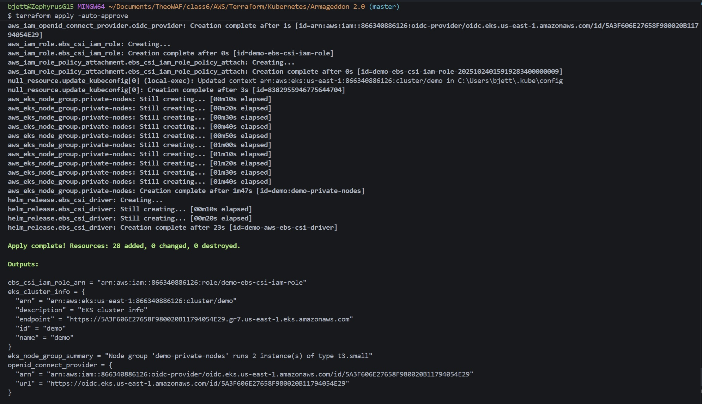
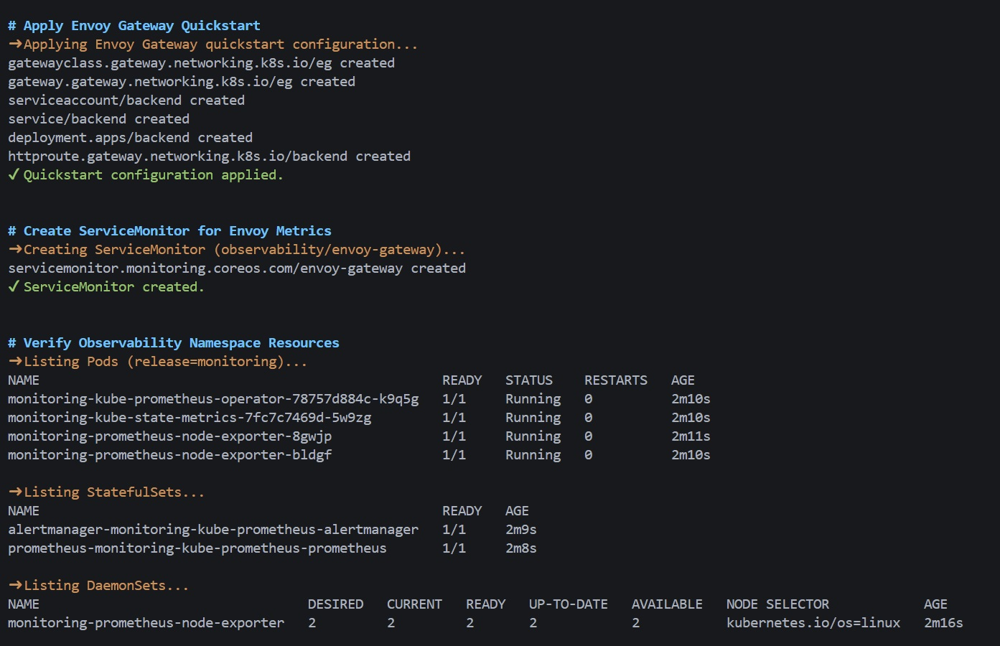
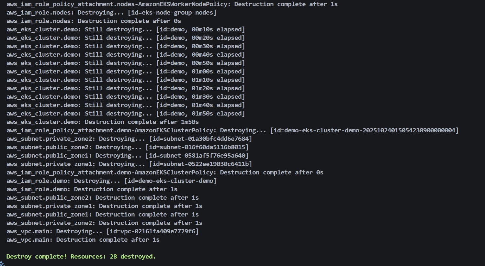

# Armageddon Task 1 — Envoy, Prometheus, and Grafana on EKS

Balerica Inc. (HQ: Sao Paulo) — Network team automation lab.

Automate Envoy Gateway plus the Prometheus and Grafana stack on Amazon EKS so the network team does not install these by hand.


---

## Requirements coverage

| Requirement | How it is met |
| --- | --- |
| Envoy in the EKS cluster | Helm chart `envoyproxy/gateway-helm` in `envoy-gateway-system` |
| Prometheus | `kube-prometheus-stack` in `observability` |
| Grafana | Same chart; UI is reached through Envoy, not a public LoadBalancer |
| Automated install | `scripts/install-monitoring.sh` |
| Screenshots of all three running | `images/` |
| Instructions in README | This file, plus `docs/RUNBOOK.md` |

---

## Layout

```plaintext
task1/
├── README.md
├── .gitignore
├── docs/RUNBOOK.md
├── images/
├── manifests/              # Grafana HTTPRoute, ServiceMonitor, PDBs
├── scripts/
│   ├── install-monitoring.sh
│   └── uninstall-monitoring.sh
├── terraform/              # numbered VPC → EKS → IRSA → EBS CSI
└── values/                 # Helm values for Envoy and kube-prometheus-stack
```

---

## Prerequisites

- Terraform >= 1.10
- AWS credentials with rights to create VPC, EKS, IAM, KMS, and Load Balancers
- `kubectl` and Helm 3
- Copy `terraform/terraform.tfvars.example` to `terraform/terraform.tfvars` and set `eks_public_access_cidrs` to your public IP `/32`

---

## Deploy

Full command-by-command steps, expected output, screenshots, and teardown are in **[docs/RUNBOOK.md](docs/RUNBOOK.md)**. Short path:

### 1. EKS platform

```bash
cd terraform
cp terraform.tfvars.example terraform.tfvars   # then edit
terraform init
terraform fmt
terraform validate
terraform plan
terraform apply
```



Terraform creates:

- VPC with public/private subnets in **two AZs** (workers stay private)
- EKS with secrets encryption, control-plane logs, and a private API endpoint
- Node group with IMDSv2 required
- IRSA for VPC CNI and EBS CSI (CNI is **not** attached to the node instance role)
- Encrypted `gp3` default StorageClass

### 2. Envoy, Prometheus, Grafana

```bash
chmod +x scripts/install-monitoring.sh
./scripts/install-monitoring.sh
```


The script:

1. Installs kube-prometheus-stack from `values/kube-prometheus-stack.yaml`
2. Installs Envoy Gateway (`v1.5.3`) with two replicas
3. Applies the Envoy quickstart Gateway
4. Routes Grafana at `/grafana` on that Gateway
5. Scrapes Envoy metrics into Prometheus via ServiceMonitor

### 3. Verify

```bash
kubectl get pods -n observability
kubectl get pods -n envoy-gateway-system
kubectl get svc -n observability
kubectl get gateway,httproute -A
```

Expect Ready pods for Prometheus, Grafana, and `envoy-gateway`.



### 4. Access

Grafana is **not** on a public LoadBalancer. Use Envoy:

```bash
kubectl get gateway eg -n default
kubectl get secret monitoring-grafana -n observability \
  -o jsonpath='{.data.admin-password}' | base64 --decode; echo
```

- Grafana: `http://<envoy-gateway-address>/grafana/`
- Username: `admin`
- Prometheus: ClusterIP only

```bash
kubectl -n observability port-forward svc/monitoring-kube-prometheus-prometheus 9090:9090
```

Then open `http://127.0.0.1:9090`.


---

## Security and self-healing (what changed)

**Least privilege**

- Node role no longer has `AmazonEKS_CNI_Policy`; CNI uses IRSA on `aws-node`
- EBS CSI uses a pinned local IAM policy and IRSA on `ebs-csi-controller-sa`
- Prometheus and Grafana are ClusterIP; only Envoy should be internet-facing
- Grafana anonymous auth is off; sign-up is off
- EKS secrets encrypted with a dedicated KMS key
- Instance metadata requires IMDSv2 with hop limit 1 (pods cannot steal node credentials)
- EKS public API CIDRs are a variable — set them to your IP

**Self-healing**

- Grafana: 2 replicas, probes, PDB `minAvailable: 1`, anti-affinity
- Envoy Gateway: 2 replicas plus PDBs
- Prometheus/Alertmanager: Kubernetes probes (chart defaults) and persistent gp3 volumes so a rescheduled pod keeps data
- Node group `min_size = 2` across two AZs (the old `min_size = 0` could drain the cluster)

---

## Uninstall

```bash
./scripts/uninstall-monitoring.sh
cd terraform && terraform destroy
```




---

## Troubleshooting

| Issue | Cause | Fix |
| --- | --- | --- |
| `gp3` missing | Terraform not applied | Apply `terraform/` first |
| Envoy address pending | NLB provisioning | Wait 3–5 min, `kubectl get gateway eg -n default` |
| Grafana 404 at `/grafana` | Route or subpath | Confirm HTTPRoute and `grafana.ini` `serve_from_sub_path` |
| Password empty | Secret not ready | Wait for Grafana pods Ready, then re-run the secret command |
| Helm release exists | Partial install | `./scripts/uninstall-monitoring.sh` then install again |
| Namespace stuck Terminating | CRD finalizers | See `docs/RUNBOOK.md` |

---

## Demo

[](https://www.youtube.com/watch?v=Ur_WtZtClqc)

---

## Authors

- **Author:** T.I.Q.S.
- **Group Leader:** John Sweeney
